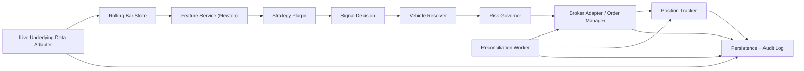

# Bhiksha Architecture

Status: Draft v2
Last updated: 2026-03-30

## Purpose

Bhiksha is the live execution runtime for strategies researched by Mala.

Day 1 scope is deliberately narrow:

- trade only the current `QQQ` and `SPY` Market Impulse setups,
- evaluate signals from completed 1-minute underlying bars only,
- trade single-leg options only,
- keep the runtime modular so future Mala strategies can be deployed without rewriting the engine.

The design should make it easy to add:

- new strategy families,
- new symbols,
- new option vehicle selection rules,
- new brokers and market data providers,
- stronger portfolio-level risk controls.

## Day 1 Goals

Day 1 is not "build the final bot." Day 1 is "build the right skeleton."

We want:

- a clean research-to-execution boundary,
- config-driven deployments,
- a minimal but reliable state model,
- durable auditability,
- an upgrade path from two strategies to many.

## Non-Goals For Day 1

- multi-leg options structures,
- direct runtime code import from Mala,
- distributed microservices,
- optimization of every transform to incremental mode,
- full broker abstraction for every broker on day one.

## Core Decisions

### 1. Research And Execution Should Meet Through A Deployment Manifest

Bhiksha should not depend on Mala internals at runtime.

Instead, Bhiksha should consume a deployment manifest that contains:

- strategy family identifier,
- strategy parameters,
- target symbols,
- session window,
- execution profile,
- risk profile,
- metadata linking the deployment back to the Mala run or CSV row.

For now, you are the bridge between Mala output and Bhiksha deployment config.
Later, Mala can emit the manifest directly.

### 2. Strategy Code Lives In Bhiksha; Mala Supplies Parameters And Recommendations

Recommendation: do not import Python strategy classes from Mala directly.

Use this model instead:

- Bhiksha owns trusted, versioned strategy plugins.
- Deployment manifests reference those plugins by `strategy_key` and parameter set.
- If Mala proposes a new parameterization of an existing strategy, no code change is needed.
- If Mala proposes a brand-new strategy family, we add one new Bhiksha plugin.

This keeps live execution deterministic and avoids coupling research code churn to production trading.

### 3. Single-Process Monolith First, Clear Boundaries From Day 1

For Day 1, use one Python process with in-memory event dispatch.

Why:

- lower operational complexity,
- easier debugging,
- lower latency than a forced multi-service split,
- enough for `QQQ` and `SPY`.

Design the boundaries so Redis, Postgres, or separate workers can be introduced later without rewriting domain logic.

### 4. Market Data And Execution Must Be Separate Concerns

Bhiksha needs two distinct data planes:

- underlying market data for signal generation,
- option chain and option quote data for contract selection and execution.

Public remains an execution broker first.
It should not be treated as the canonical source for 1-minute OHLCV bars.

### 5. Provider Choice For Day 1

Recommended direction:

- primary live underlying data target: `Schwab` adapter,
- historical backfill and research compatibility: `Polygon` adapter,
- execution broker: `Public` adapter.

Rationale:

- your current Polygon access is delayed, so it should not be the default live signal source,
- Public does not solve the live OHLCV problem,
- Schwab is the most promising place to standardize live bar ingestion behind an adapter,
- because provider capability can drift, Bhiksha should be built around interfaces rather than hard wiring to one vendor.

Important note:

- On 2026-03-29, the official Schwab developer portal was not returning normal documentation pages during this architecture pass, so exact endpoint details could not be re-verified from the primary source.
- Because of that, the architecture should treat Schwab as the preferred live target, not as an irreversible assumption.

### 6. SQLite First, With Strong Audit Trails

Start with SQLite for Day 1.

Persist:

- deployments,
- signals,
- orders,
- positions,
- reconciliation snapshots,
- event log,
- application checkpoints and health markers.

Do not make the live rolling bar cache a database dependency on day one.
On restart, rebuild warm state from provider backfill.

## Design Principles

1. All timestamps stored internally in UTC.
2. All session logic evaluated in `America/New_York`.
3. Only completed bars may generate signals.
4. Strategy logic must remain side-effect free.
5. Vehicle selection is a separate step from signal generation.
6. Risk checks must run before any entry order is sent.
7. Order state and position state should be modeled separately to avoid another oversized FSM.
8. Every trading decision must be reproducible from config plus event history.

## High-Level Flow



## Runtime Components

### 1. Config Loader

Loads and validates:

- `.env` for secrets and environment-specific values,
- `config/*.yaml` for application settings,
- `config/deployments/*.yaml` for strategy deployments,
- `config/risk/*.yaml` for risk defaults,
- `config/vehicles/*.yaml` for option selection rules.

Config precedence:

`env override > deployment file > shared defaults`

### 2. Deployment Registry

The registry is responsible for answering:

- which deployments are enabled,
- which symbols they subscribe to,
- which strategy plugin should be used,
- which execution and risk profile applies.

Each deployment should have a stable `deployment_id`.

Example:

- `market_impulse_qqq_short_v1`
- `market_impulse_spy_short_v1`

### 3. Underlying Market Data Service

Responsibilities:

- subscribe to or poll live 1-minute bars for `SPY`, `QQQ`, and later more symbols,
- normalize timestamps to UTC,
- reject premarket and after-hours bars for strategy evaluation,
- warm up at least two trading days of 1-minute history per symbol,
- emit `BarClosed` events only after the bar is final.

Recommended internal split:

- `MarketDataAdapter`: provider-specific IO,
- `WarmStartService`: loads recent history,
- `RollingBarStore`: in-memory per-symbol buffers,
- `SessionGuard`: ET session validation.

Current Bhiksha runtime implementation:

- Day 1 uses an in-process event bus backed by `asyncio.Queue`.
- A runtime-owned `DataIngestionDaemon` wakes on the closed-bar heartbeat and publishes `BarClosedEvent`.
- The runtime trading session routes those events onto per-symbol workers.
- Symbol workers preserve in-symbol ordering while allowing `QQQ`, `SPY`, and future symbols to progress independently.
- Background token daemons refresh Public and Schwab credentials ahead of expiry, with request-path refresh retained only as a fallback.

### 4. Feature Service

This layer wraps the Newton pipeline.

For Day 1:

- port the existing Polars-based Newton modules with minimal behavior change,
- use the current `PhysicsEngine` compatibility facade,
- compute only the features required by the active deployment set,
- allow multi-timeframe joins such as `impulse_regime_1h` onto the 1-minute base frame.

Important implementation choice:

- Day 1 may recompute enrichment against the rolling window on each bar close for correctness and speed of delivery.
- Incremental transform optimization is a later performance task.

This is acceptable because Day 1 symbol count is tiny.

### 5. Strategy Plugin Layer

Each strategy plugin should be pure and deterministic.

Suggested interface:

```python
class StrategyPlugin(Protocol):
    key: str

    def required_features(self, params: dict) -> set[str]: ...
    def evaluate_entry(self, frame: pl.DataFrame, params: dict) -> "SignalDecision": ...
    def evaluate_exit(
        self,
        frame: pl.DataFrame,
        params: dict,
        position: "PositionRecord",
    ) -> "ExitDecision": ...
```

For compatibility with Mala-era strategy code, Bhiksha may also support adapters around `generate_signals(df)` style strategies.

Day 1 plugin set:

- `market_impulse`

Future plugin examples:

- `compression_breakout`
- `opening_drive`
- `elastic_band_reversion`

Important refinement from live validation:

- Entry logic and exit logic must both belong to the strategy plugin contract.
- Bhiksha should not hard-code Market Impulse exits into the execution layer.
- The execution layer should only orchestrate strategy-produced decisions.

### 6. Vehicle Resolver

This is a new Bhiksha-specific layer and one of the most important design additions.

Its job is to translate:

- underlying signal direction,
- deployment config,
- current option chain,
- broker/account constraints

into a specific tradable option contract.

For Day 1:

- long underlying signal -> buy call,
- short underlying signal -> buy put,
- mostly `0-7` DTE,
- delta and liquidity filters live in config,
- no multi-leg structures.

This layer exists because Mala currently recommends signal logic better than it recommends execution vehicle selection.

### 7. Risk Governor

All entry requests must pass through a global risk gate.

Day 1 defaults should be conservative and env-driven.

Suggested initial controls:

- one open position per `deployment_id`,
- one open position per symbol,
- maximum two open positions total,
- maximum premium-at-risk per trade,
- maximum daily realized plus unrealized drawdown,
- kill switch that blocks new entries and can force orderly exits.

The Risk Governor should never contain strategy logic.
It only evaluates account-level and deployment-level policy.

### 8. Broker Adapter And Order Manager

Responsibilities:

- place entry and exit orders,
- manage idempotency,
- handle tick-size corrections,
- track order status,
- place protection orders when the broker supports them,
- normalize broker payloads into Bhiksha domain records.

Day 1 recommendation:

- port the strongest parts of the existing Public order manager and broker adapter,
- refactor them behind Bhiksha interfaces,
- keep quote and option-chain retrieval isolated from order placement.

### 9. Position Tracker

Avoid the old "everything in one giant FSM" trap.

Use two related but separate models:

- `OrderState`
- `PositionState`

Suggested position states:

- `FLAT`
- `ENTRY_PENDING`
- `OPEN`
- `EXIT_PENDING`
- `CLOSED`
- `HALTED`
- `ERROR`

Suggested order states:

- `CREATED`
- `SUBMITTED`
- `ACKNOWLEDGED`
- `PARTIALLY_FILLED`
- `FILLED`
- `CANCELED`
- `REJECTED`
- `EXPIRED`

This keeps the lifecycle understandable without hard-coding strategy-specific states.

### 10. Position Lifecycle Engine

This needs to become a first-class runtime component.

The current design was strong on signal generation and entry planning, but live validation showed that Bhiksha also needs a dedicated engine for:

- post-fill protection,
- algorithmic exits,
- profit-locking behavior,
- hard-flat cleanup,
- stop cancellation/replacement,
- broker-state recovery after restart.

Recommended component split:

- `PositionTracker`
  Owns the in-memory and persistence-backed view of open positions and pending exits.

- `PositionMonitor`
  On every completed bar, evaluates all open positions for exit conditions.

- `ExitPlanner`
  Converts an `ExitDecision` into a broker action: square-off market order, target order, stop tighten, cancel/replace, or no-op.

- `ProtectionManager`
  Ensures a catastrophe stop exists after entry and stays coherent with the current position quantity.

- `ReconciliationWorker`
  Adopts, repairs, or halts mismatched broker state.

This is the scalable replacement for the old oversized FSM.

### 11. Exit Policy Model

Entries and exits should both be driven by deployment config, but through separate config blocks.

Recommended addition to deployment manifests:

```yaml
exit:
  profile: market_impulse_exit_v1
  use_algorithmic_exit: true
  use_profit_target: false
  profit_target_multiple: null
  target_approach_offset_pct: null
  target_pullback_restore_progress_pct: null
  stop_loss_pct: 0.45
  stop_to_breakeven_after_r_multiple: null
  hard_flat_time_et: "15:55"
```

This lets future strategies express:

- VMA reclaim exits,
- stage/regime change exits,
- target-based exits,
- anticipatory target activation for brokers with one-resting-order constraints,
- pullback-based stop restoration after target activation,
- break-even promotion,
- trailing stop rules,
- time-based exits.

The key design choice is:

- `risk` controls whether a trade is allowed and what hard guardrails exist,
- `exit` controls how an open position is managed after entry.

Broker capability note:

- Public should be treated as a `single_resting_exit_order` broker.
- That means Bhiksha must not rely on broker-side OCO or simultaneous resting stop-plus-target behavior for Public option positions.
- For Public, the default posture is one broker-side catastrophe stop plus app-managed virtual targets, algorithmic exits, and cancel/replace sequencing.

That separation will matter once we support many strategy families.

### 12. ExitDecision Contract

Suggested normalized exit contract:

```json
{
  "deployment_id": "market_impulse_qqq_short_v1",
  "symbol": "QQQ",
  "timestamp_utc": "2026-03-30T14:22:00Z",
  "exit": true,
  "action": "square_off",
  "reason": [
    "vma_reclaim_exit"
  ],
  "cancel_protection_orders": true,
  "replacement_stop": null,
  "target_price": null
}
```

Possible `action` values:

- `hold`
- `square_off`
- `place_target`
- `tighten_stop`
- `cancel_target`
- `cancel_stop`
- `halt_position`

This is more scalable than embedding every exit nuance into broker code or giant position states.

### 13. Reconciliation Worker

Runs on an interval and compares:

- broker open orders,
- broker positions,
- Bhiksha local order records,
- Bhiksha local position records.

If there is a mismatch:

- raise a reconciliation alert,
- mark affected deployments or positions as `HALTED`,
- block new entries until resolved.

Important live-trading refinement:

- reconciliation should also run on every completed bar for traded symbols, not only on a coarse timer,
- the timer-based worker remains useful as a backstop,
- the bar-level sync is what prevents duplicate entries after restart.

### 14. Persistence And Audit

Recommended Day 1 tables:

- `deployments`
- `signals`
- `orders`
- `positions`
- `position_actions`
- `events`
- `reconciliation_runs`
- `app_checkpoints`

Every meaningful event should be appended to `events`:

- bar processed,
- signal emitted,
- risk reject,
- order submitted,
- order fill,
- stop placement result,
- target placement result,
- stop tighten result,
- exit triggered,
- exit submission,
- exit fill,
- reconciliation mismatch,
- kill switch activation.

## Contracts

### Deployment Manifest Example

```yaml
deployment_id: market_impulse_qqq_short_v1
enabled: true
symbol: QQQ

strategy:
  key: market_impulse
  version: 1
  params:
    direction: short
    entry_buffer_minutes: 5
    entry_window_minutes: 60
    regime_timeframe: 1h
    vma_length: 10
    session: regular_hours

execution:
  profile: single_leg_long_premium_v1
  option_mapping:
    long_signal: CALL
    short_signal: PUT
  dte_min: 0
  dte_max: 7
  target_abs_delta_min: 0.20
  target_abs_delta_max: 0.40
  min_open_interest: 100
  max_bid_ask_spread_pct: 0.20

risk:
  profile: conservative_day1
  max_trade_premium_usd: 300
  hard_flat_time_et: "15:55"

source:
  origin: mala
  run_date: "2026-03-28"
  artifact: "m5_execution_mapping.csv"
```

### BarClosed Event Example

```json
{
  "event_type": "BAR_CLOSED",
  "symbol": "QQQ",
  "timeframe": "1m",
  "timestamp_utc": "2026-03-29T14:35:00Z",
  "bar": {
    "open": 521.12,
    "high": 521.44,
    "low": 520.98,
    "close": 521.03,
    "volume": 1843290
  },
  "provider": "schwab"
}
```

### SignalDecision Example

```json
{
  "deployment_id": "market_impulse_qqq_short_v1",
  "symbol": "QQQ",
  "timestamp_utc": "2026-03-29T14:35:00Z",
  "signal": true,
  "direction": "short",
  "reason": [
    "time_window_ok",
    "regime_bearish_1h",
    "cross_and_reclaim_short"
  ],
  "features": {
    "vma_10": 521.10,
    "impulse_regime_1h": "bearish"
  }
}
```

### ExitDecision Example

```json
{
  "deployment_id": "market_impulse_qqq_short_v1",
  "symbol": "QQQ",
  "timestamp_utc": "2026-03-30T14:42:00Z",
  "exit": true,
  "action": "square_off",
  "reason": [
    "vma_reclaim_exit"
  ],
  "cancel_protection_orders": true
}
```

## Market Impulse Day 1 Flow

For the current Day 1 deployment set:

1. Warm up two trading days of 1-minute bars for `QQQ` and `SPY`.
2. On each closed 1-minute bar, enrich the rolling frame.
3. Evaluate the configured Market Impulse deployment for that symbol.
4. If signal is false, persist audit and continue.
5. If signal is true, call the Vehicle Resolver.
6. If no acceptable option contract is found, persist a rejected decision.
7. If a contract is found, run Risk Governor checks.
8. If approved, place the entry order.
9. After fill, ensure catastrophe stop placement.
10. On every completed 1-minute bar, evaluate open positions with `evaluate_exit(...)`.
11. If the strategy requests an exit, cancel/replace protection as needed and submit the exit order.
12. If no algorithmic exit occurs, still enforce hard-flat time and catastrophe stop protection.
13. Reconcile against the broker on every bar and on a timer.

## Market Impulse Exit Model

For the Day 1 Market Impulse short setup, the scalable design should support:

- catastrophe stop immediately after fill,
- algorithmic square-off if price reclaims the VMA on a completed 1-minute bar,
- optional profit-target logic as a deployment-configurable policy,
- forced hard-flat at `15:55 ET`.

Recommended Day 1 interpretation:

- entry:
  bearish 1-hour regime, intrabar cross above VMA, close back below VMA on the completed 1-minute bar.
- exit:
  for an open long put position, square off when the underlying invalidates the short thesis on a completed bar,
  such as a reclaim above VMA or another explicitly configured Market Impulse exit event.

This means Bhiksha should own a generalized position management loop, not only an entry loop.

## Data Separation

There are three different data objects Bhiksha must treat differently:

1. Underlying bars
   Used for signal generation on `SPY` and `QQQ`.

2. Option chain and option quotes
   Used for contract discovery and trade entry.

3. Account and order state
   Used for risk, fills, reconciliation, and capital control.

Do not mix these concerns into one service.

## Configuration Model

Recommended config layout for the future scaffold:

```text
config/
  app.yaml
  providers.yaml
  risk/
    conservative.yaml
  vehicles/
    single_leg_long_premium_v1.yaml
  deployments/
    market_impulse_qqq_short_v1.yaml
    market_impulse_spy_short_v1.yaml
```

Use `.env` for:

- API keys,
- broker secrets,
- account identifiers,
- environment toggles,
- emergency kill-switch overrides.

## Recommended Repository Layout

```text
docs/
  architecture.md
  agent.md

config/
  ...

src/bhiksha/
  app/
    bootstrap.py
    runtime.py
  config/
    loader.py
    models.py
  domain/
    events.py
    models.py
    enums.py
  strategy/
    base.py
    registry.py
    market_impulse.py
  market_data/
    adapters/
      base.py
      polygon.py
      schwab.py
    bar_store.py
    warm_start.py
    feature_service.py
    session.py
  options/
    chain_service.py
    vehicle_resolver.py
    selectors.py
  execution/
    brokers/
      base.py
      public.py
    order_manager.py
    fill_handler.py
  risk/
    governor.py
    rules.py
  state/
    position_tracker.py
    reconciliation.py
  persistence/
    models.py
    repository.py
    sqlite.py
  ops/
    logging.py
    health.py
    telemetry.py

tests/
  ...
```

## Reuse Plan From The Salvage Modules

### Likely Keep With Refactor

- `tmp/newton/engine.py`
- `tmp/newton/transforms.py`
- `tmp/newton/market_impulse.py`
- `tmp/newton/resampler.py`
- `tmp/api_client.py`
- `tmp/order_manager.py`
- `tmp/brokers/`
- `tmp/utils/symbols.py`
- `tmp/utils/pricing.py`
- `tmp/utils/market_hours.py`

### Keep Conceptually, Rewrite Structurally

- `tmp/account.py`
  Useful account ideas, but it should be refactored into Bhiksha service boundaries.

- `tmp/market_data.py`
  Useful for quote and chain lookup patterns, but not as the primary live-bar service.

### Do Not Port As-Is

- `tmp/persistence/db_repo.py`
- `tmp/persistence/gds_repo.py`

These are too coupled to the old trade model and should be replaced with a Bhiksha-native persistence layer.

## Testing Strategy

Before live trading, Bhiksha should support:

- replay tests using saved 1-minute bars,
- parity tests between Mala Market Impulse output and Bhiksha signal output,
- contract selection tests for DTE and delta filters,
- risk rejection tests,
- exit decision parity tests,
- protection-order lifecycle tests,
- stop-cancel-on-exit tests,
- restart-with-open-position tests,
- reconciliation mismatch tests,
- dry-run mode with no live orders.

## Rollout Plan

### Phase 1: Architecture And Scaffold

- finalize architecture,
- create repo layout,
- define config and domain models,
- port Newton modules.

### Phase 2: Data And Signal Parity

- build warm start and live bar interfaces,
- wire Market Impulse plugin,
- confirm Bhiksha signals match Mala expectations on replay data.

### Phase 3: Vehicle Resolver And Risk Layer

- implement single-leg contract selection,
- implement conservative risk rules,
- add dry-run and audit logging.

### Phase 4: Broker Execution

- port and refactor Public execution components,
- add fill handling,
- add reconciliation worker,
- add position monitor and exit planner.

### Phase 5: Paper And Controlled Live Validation

- run dry mode,
- run paper or shadow mode if available,
- trade smallest live size only after replay, reconciliation, and exit-management confidence are established.

## Explicit Assumptions In This Draft

- Day 1 trading is based on underlying `SPY` and `QQQ` signals, not option bars.
- Day 1 vehicle is single-leg long premium only.
- Day 1 storage is SQLite.
- Bhiksha owns trusted strategy plugins and consumes manifest-style deployment config.
- Schwab is the preferred live underlying-data target, but the system must remain provider-agnostic because Schwab API details still need hands-on validation in the scaffold phase.

## Immediate Next Build Steps

1. Decide the Day 1 deployment policy for `use_profit_target` and `stop_to_breakeven_after_r_multiple` in the active manifests.
2. Add replay cases for target hits, breakeven promotions, and restart recovery with both stop and target orders already live.
3. Harden cancel/replace flows when a target partially fills or a stop promotion races with a broker-side state change.
4. Add operator-facing session summaries and post-run reconciliation diagnostics.
5. Extend the same lifecycle contract to the next non-Market-Impulse strategy plugin.
