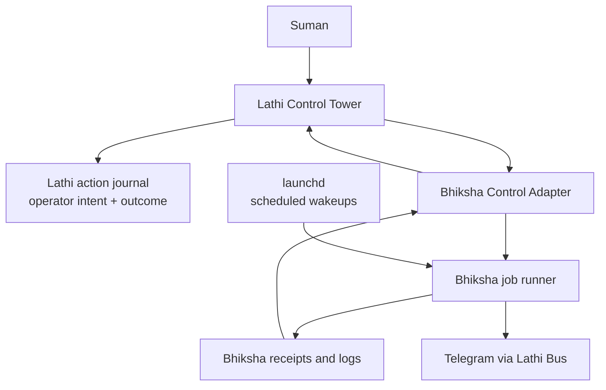

# Bhiksha Jobs in Lathi Control Tower

## Purpose

Bhiksha now owns its launchd jobs, which is the right operational boundary for
trading. The missing piece is an operator cockpit: when Bhiksha is stopped,
stale, or simply making the operator anxious, Suman should be able to open
Lathi Control Tower, inspect Bhiksha job state, and trigger safe manual actions
without SSHing into oldmac.

The intended design is:

```text
Bhiksha is the engine.
launchd is the clock.
Lathi Control Tower is the cockpit.
```

Lathi may own the visible button, action journal event, and operator workflow.
Bhiksha still owns the actual trading-safe command and the meaning of success or
failure.

## Current State

### Bhiksha

Bhiksha already owns the active launchd jobs:

| Label | Schedule | Purpose |
| --- | --- | --- |
| `com.bhiksha.live-start` | Weekdays 08:20 CT | Restart live runtime from active plan. |
| `com.bhiksha.live-watchdog` | Weekdays every 10 minutes from 08:30 through 15:00 CT | Ensure the live runtime is running. |
| `com.bhiksha.live-stop` | Weekdays 15:10 CT | Stop stale live runtime. |
| `com.bhiksha.schwab-guard` | Weekdays 07:10 CT | Validate or renew Schwab auth and alert when unusable. |
| `com.bhiksha.session-report` | Weekdays 09:10, 11:45, and 14:45 CT | Send intraday status, PnL, open positions, and runtime concerns. |

The one command runner is:

```bash
scripts/launchd/run_bhiksha_job.sh <job>
```

The runner already prints a structured line:

```text
BHIKSHA_LAUNCHD_JOB={...json...}
```

That line is the best first observation contract for Lathi. It lets Control
Tower render job status and lets a manual Control Tower action capture the
Bhiksha-owned result without reimplementing Bhiksha logic.

### Lathi

The Lathi aspirational worldview says Lathi should be the small operating core
that owns clock, mutation discipline, runtime routing, projections, and
recovery, while substrates and domain systems own their own specialized work.
It also says Lathi must not become a domain-heavy second Lane Host.

The current Lathi Control Tower already behaves like a projection/read model. It
fuses pack registry, kernel ledger, and daemon heartbeat into a dashboard, and
actions are intentionally read-only until an intent queue exists.

For Bhiksha, that means the clean extension is not "move trading jobs into
Lathi." The clean extension is "teach Lathi to observe and safely invoke
Bhiksha-owned jobs through an explicit adapter."

## Desired Feature State

Control Tower should have a Bhiksha section under the trading job family. It
should show all Bhiksha launchd jobs, the live runtime, and the latest report or
guard receipts in one place.



The operator experience should support these use cases:

1. See whether each Bhiksha launchd label is loaded and recently healthy.
2. See whether live runtime is running, stale, or missing.
3. See latest job run time, status, exit code, and short error tail.
4. Click "Run Session Report Now" and receive the Telegram report.
5. Click "Check/Ensure Live Runtime" and have Bhiksha run its own watchdog path.
6. Click "Run Schwab Guard Now" and have Bhiksha validate token state.
7. See an action journal entry for every Control Tower initiated action.
8. See observed scheduled failures, even if launchd rather than Lathi started
   the job.

Control Tower should not infer trading truth from Telegram alone. Telegram is a
projection. Runtime status, Bhiksha receipts, logs, and command result JSON are
the evidence.

## Bhiksha Development Needed

### 1. Add a launchd job registry

Create a machine-readable registry for the five Bhiksha jobs. The registry
should be the shared source for docs, installer generation, and status output.

Suggested file:

```text
src/bhiksha/ops/launchd_registry.py
```

Each job record should include:

- launchd label;
- Bhiksha runner job name;
- schedule label for humans;
- trading-day skip behavior;
- log file paths;
- risk class;
- allowed manual actions;
- whether the action is safe during market hours;
- the command line Lathi should call.

This avoids Lathi scraping shell scripts for meaning.

### 2. Add a Bhiksha status snapshot command

Create:

```bash
python -m bhiksha.tools.launchd_status --json
```

The output should contain one JSON object with:

- generated timestamp and host;
- repo root and active plan path;
- one row per Bhiksha launchd label;
- `loaded`, `enabled`, and last launchd exit state where available;
- last `BHIKSHA_LAUNCHD_JOB` payload parsed from the job stdout log;
- stderr/out tail paths, not secret contents;
- latest Schwab token guard receipt summary;
- latest session report path and status;
- latest alert/transport attempt summary, including whether the report or guard
  result was delivered through Lathi Bus / Telegram;
- live runtime status from `bhiksha.tools.server_session status`.

This command is the read-only contract Lathi should consume.

The status shape should distinguish domain health from transport health. For
example, a session report can be GREEN while the operator notification failed.
Control Tower should render that as "Bhiksha healthy; alert transport degraded,"
not as a trading failure.

### 3. Add a Bhiksha control command

Create:

```bash
python -m bhiksha.tools.launchd_control <action> --json
```

Initial actions:

| Action | Underlying Bhiksha behavior | Gate |
| --- | --- | --- |
| `session-report-now` | `run_bhiksha_job.sh session-report --force --report-label manual` | No extra gate. |
| `schwab-guard-now` | `run_bhiksha_job.sh schwab-refresh --force` | No extra gate, but loud failure alert stays Bhiksha-owned. |
| `ensure-live-runtime` | `run_bhiksha_job.sh live-watchdog --force` | Confirm when market is open or when the action would start a stopped live runtime. |
| `live-status` | `python -m bhiksha.tools.server_session status` | Read-only. |

Later actions such as `restart-live-runtime` and `stop-live-runtime` should
exist behind an explicit confirmation gate because they can affect live trading.

The command should emit a single structured JSON result and preserve the
existing `BHIKSHA_LAUNCHD_JOB` payload when it invokes the runner. It should also
accept or create a correlation id, such as `action_id`, and echo it in every
result so Lathi can connect:

```text
operator click -> Lathi action journal -> Bhiksha command -> Bhiksha receipt
```

Manual controls should be concurrency-safe. If the same action is already
running, Bhiksha should refuse, coalesce, or return the in-flight action rather
than starting duplicate session reports, token guards, or runtime ensures.

### 4. Persist observed scheduled outcomes

Scheduled launchd runs happen outside Lathi, but they should still be visible.
Bhiksha should write or update a compact file after each run:

```text
artifacts/playbook/launchd/latest_status.json
```

This file should be derived from non-secret receipts and log summaries. Lathi
can read this file or call `launchd_status --json`; the file makes the dashboard
fast and stable even when a command call is undesirable.

### 5. Keep Bhiksha alert ownership

Bhiksha should continue deciding when to send Lathi Bus alerts. Lathi may expose
the alert result, but it should not duplicate the same failure alert. Otherwise
one Schwab token failure could become two noisy Telegram messages.

## Lathi Development Needed

### 1. Add an external observed job source

Lathi should gain a small adapter for systems it observes but does not own.

Suggested module:

```text
lathi/external_jobs.py
```

or, if the current Control Tower read model remains the main home:

```text
lathi/control_tower/external_sources.py
```

The adapter should be configured with:

- source id: `bhiksha`;
- display group: `C` or `trading`;
- status command: `python -m bhiksha.tools.launchd_status --json`;
- action command: `python -m bhiksha.tools.launchd_control <action> --json`;
- repo root: oldmac Bhiksha checkout path;
- timeout and redaction policy.

This keeps Lathi generic. It learns how to host external job cards, not how to
trade.

### 2. Extend Control Tower state

The existing Control Tower snapshot should include external observed jobs next
to pack/kernel units.

Fields should map cleanly onto existing tower ideas:

- `unit_id`: Bhiksha label or control id;
- `kind`: `external_launchd_job`;
- `serves_job`: `C`;
- `declared_enabled`;
- `effective_enabled`;
- `lifecycle`: `armed`, `running`, `stuck`, `idle`, or `retired`;
- `schedule`;
- `next_fire` if known;
- `last_run_status`;
- `last_run_at`;
- `findings`;
- `available_actions`;
- `risk_class`;
- `source`: `bhiksha`.

The Lathi aspirational docs emphasize that projections should explain what
happened without pretending to be the source of truth. This extension should
follow that: the tower renders Bhiksha status, but Bhiksha receipts and commands
remain the evidence.

### 3. Add a Control Tower intent queue before live actions

The current Lathi server returns `501` for actions because it does not yet have
an intent queue. For Bhiksha manual controls, Lathi needs a minimal operator
action journal or kernel-backed action path:

```text
operator click
  -> Lathi writes action journal entry: requested
  -> Lathi invokes Bhiksha control command
  -> Lathi captures stdout/stderr summary and JSON result
  -> Lathi writes action journal entry: succeeded, failed, or timed out
  -> Control Tower refresh shows result
```

This does not need the full workflow kernel for phase 1. It does need durable
records so the operator can see who clicked what and when. Do not call this the
"Lathi ledger" unless it is actually written through the workflow kernel ledger;
otherwise it is an operator action journal owned by Lathi Control Tower.

### 4. Render safe actions as real buttons

In phase 1, only low-risk actions should be real buttons:

- `live-status`;
- `session-report-now`;
- `schwab-guard-now`;
- `ensure-live-runtime`, only when Lathi can show the confirmation rule and
  Bhiksha can refuse unsafe or duplicate starts.

Trading-impacting lifecycle actions should render as disabled or require a
second confirmation:

- `restart-live-runtime`;
- `stop-live-runtime`;
- any action that could submit, cancel, or modify broker orders.

### 5. Avoid making Lathi the Bhiksha scheduler

Lathi has scheduler primitives, and its worldview says it can own clock and
recovery for its own work. That does not mean every external domain job must
move into the Lathi daemon.

For Bhiksha, scheduled wakeups should stay in Bhiksha-owned launchd jobs for
now because:

- launchd already handles reboot recovery;
- Bhiksha performs trading-day and market-safety checks;
- duplicate schedulers would create split-brain risk;
- oldmac runtime evidence already depends on Bhiksha logs and receipts.

Lathi can still observe scheduled outcomes and run manual operator actions.

## Deployment Phases

### Phase 1: Read-only visibility plus safe manual controls

Goal: make Control Tower useful without changing scheduled ownership.

Build:

- Bhiksha launchd registry.
- Bhiksha `launchd_status --json`.
- Bhiksha `launchd_control --json` for safe actions.
- Lathi external observed job adapter for Bhiksha.
- Lathi Control Tower cards for Bhiksha jobs.
- Lathi action journal records for Control Tower initiated actions.

Do not build yet:

- moving Bhiksha schedules into Lathi;
- restart/stop live runtime buttons without confirmation;
- unconfirmed `ensure-live-runtime` when market is open or when it would start a
  stopped live process;
- broker/order-changing controls;
- duplicate Telegram failure alerts from Lathi.

Operator result:

- Suman can open Control Tower, see Bhiksha job health, click report now, click
  Schwab guard now, and click ensure live runtime behind the configured
  confirmation rule.
- Scheduled launchd runs continue exactly as before.

## Development Ownership

This should be developed as a two-repo contract, not as one agent building both
sides from one viewpoint.

Bhiksha should own:

- `launchd_registry`;
- `launchd_status --json`;
- `launchd_control --json`;
- `latest_status.json`;
- action ids, concurrency behavior, and command result schema;
- the Python/runtime repair that makes Lathi Bus transport reliable from
  launchd;
- tests proving no secrets leak and every action uses Bhiksha-owned logic.

Lathi should own:

- the generic external observed source adapter;
- the Control Tower read model and cards;
- the operator action journal or kernel-backed intent path;
- confirmation UI and risk rendering;
- correlation between Lathi action ids and Bhiksha receipts;
- observer-level stale-source detection that does not duplicate Bhiksha alerts.

Codex should supervise the integration boundary and end-to-end oldmac proof.
The Bhiksha agent can build the Bhiksha side because it knows the trading
runtime. Lathi work should stay in Lathi because it needs the broader substrate,
Control Tower, and action-journal context.

### Phase 2: Guarded trading-runtime controls and stale-job monitoring

Goal: make Control Tower a fuller Bhiksha operator console after phase 1 is
boring.

Build:

- confirmation gate for `restart-live-runtime` and `stop-live-runtime`;
- stale scheduled-job detection in Lathi Control Tower;
- optional Lathi alert for observer-level problems, such as "no Bhiksha status
  snapshot has updated for N minutes";
- richer correlation between Lathi action journal entries and Bhiksha receipts;
- `next_fire` calculation from the Bhiksha registry if launchd does not expose
  it cleanly.

Still do not build without a separate architecture decision:

- Lathi as the primary Bhiksha scheduler;
- Lathi-owned trading logic;
- Lathi-owned broker submission, cancellation, or position management.

Operator result:

- Suman can recover Bhiksha runtime from Control Tower with explicit gates.
- Suman can distinguish "Bhiksha failed" from "Lathi cannot observe Bhiksha."
- The dashboard becomes the first place to look during market hours.

## Verification

### Phase 1 verification

Phase 1 is working when all of these are true on oldmac:

1. `python -m bhiksha.tools.launchd_status --json` returns all five active
   `com.bhiksha.*` jobs with no secrets and valid JSON.
2. Control Tower renders the five Bhiksha jobs under the trading group.
3. `session-report-now` from Control Tower causes Bhiksha to send a Telegram
   session report and writes both:
   - a Bhiksha job result or report receipt;
   - a Lathi action journal entry.
4. `schwab-guard-now` from Control Tower returns a healthy token receipt or a
   loud Bhiksha-owned failure alert.
5. `ensure-live-runtime` from Control Tower calls Bhiksha's watchdog path and
   reports whether the live runtime is running.
6. Existing launchd schedules still run without Lathi involvement.
7. Old OpenClaw/browser-agent Bhiksha labels remain unloaded.
8. No duplicate Telegram alerts are sent for a single failure.

### Phase 2 verification

Phase 2 is working when all of these are true:

1. Restart/stop live runtime controls require an explicit confirmation step.
2. Every confirmed action has a durable Lathi intent and outcome record.
3. Every Lathi action outcome links to the Bhiksha command result or receipt.
4. Control Tower marks jobs stale when scheduled evidence is missing past the
   expected window.
5. A stale observer condition is distinct from a Bhiksha job failure.
6. A manual session report at an arbitrary time, such as 10:00 CT, reaches
   Telegram and appears in both Bhiksha receipts and Lathi Control Tower.
7. Live trading behavior remains governed by Bhiksha, not by Lathi.

## One Sentence to Remember

Bhiksha should continue to own trading behavior, but Lathi Control Tower should
become the place where Suman sees, audits, and safely triggers Bhiksha-owned
operations.
